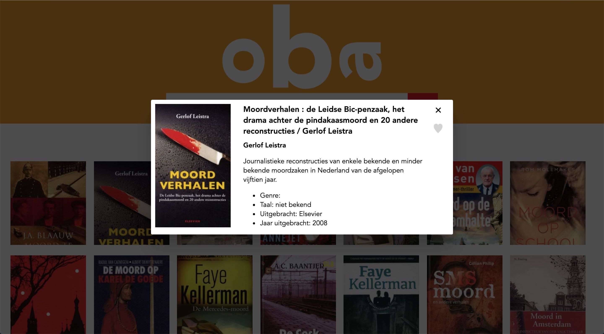

# OBA recommended books

## Summary
A single page web application search for recommended books, based of books you already read. Also you will find all popular books in that specific week.

## Table of contents
1.  [Live demo link](#1-Live-demo-link)
2.  [Concept](#2-Concept)
3.  [The solution](#3-The-solution)
4.  [How does it work?](#4-How-does-it-work?)
5.  [Design](#5-Design)
6.  [What is there now?](#6-What-is-there-now?)
7.  [Future functionality?](#7-Future-functionality?)

## 1. Live demo link
[Link to Recommended books OBA](http://oba-recommended.tjebbemarchand.nl/)

## 2. Concept
A concept where you can find a book you have read that you like, the app finds recommended books you also will like.
If the results are on the page, when clicked on a book all the details of that specific book is displayed. Here you can like that book so the app can do a better job the next time you want to find a book.

The target audience this application is for adults. The app is designed for people that like to read often. Kids can you use it to if they like the idea.

## 3. The problem and the solution
A lot of the times people are looking for a long time for something to read like a book. They don’t know what to choose because they don’t know what is good. If there was a way to recommend books based on books you’ve already read, it would make it a lot easier.
My app is the solution to this problem. You can find the book you have read and the app recommends books for you.

## 4. How does it work?
The app searches for meta data about the book you searched for. Based on the meta data it looks for other books that has similar data. Also it can detect what other people read and finds enjoyable and based on that it does a better recommendation.

The meta data it searches for is:
- Target audience
- Author
- Genre
- Publication
- Language
- Subject
- Page count
- Format

Some of this data is missing in the API. So the app / concept can do a better job if it has that data available.

## 5. Design

First there is a header section where the search bar is located. That is the main function of the app. Below you will find the popular books of the week.

When searching for a book it shows the searched and a recommended list of books.

If clicked on one of the books, a popup shows up where all the details are placed and where you can like the book so the app knows about it so it can do a better job.

## 6. What is there now?
I have build a prototype of the app. You can search for books you like and it shows recommended books based on what you searched for. There is not an algorithm in place to recommended books yet. It is a prototype to give the feeling of the app.

The design is very basic for only the functionality I could provide within a week. It’s not responsive yet.

## 7. Future functionality?
When the app will go further in development, there will be an algorithm to recommend books. And the design would be responsive for all sorts of devices.
